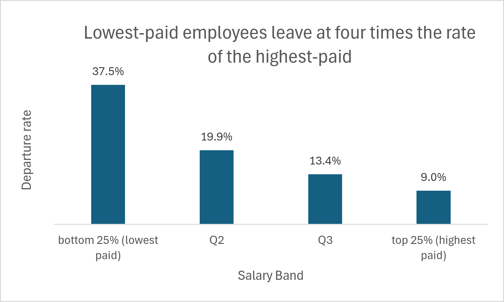

# Employee Attrition Analysis

**Question:** Do lower-paid employees leave more often — and if so, is it really about pay, or just because they are newer?

**Answer:** Low pay is linked to leaving, and it holds even after accounting for tenure. It is a company-wide pay-level problem, not a department problem.

*Company-wide across all departments. MySQL "employees" sample database, ~300k employees.*

The problem is concentrated, not gradual. The rate drops sharply from the bottom quartile, Q1 (37.5%), to the next band up, Q2 (19.9%), then flattens out. This means attrition is a bottom-quartile problem specifically — not a smooth effect spread across the whole pay scale.

---

## Key findings

1. **Attrition is flat across departments** — every department loses about 1 in 5 employees (19.5%–20.5%). Department does not explain who leaves.

2. **The lowest-paid quartile drives it** — inside every department, leaving concentrates in the bottom 25% of salaries.

3. **It is pay, not just tenure** — comparing employees hired in the same year (same experience level), the lowest-paid still left more in all 16 hire-year groups. Being newer is not the explanation.

---

## Where it matters most

Two lenses point to two different places, both worth attention:

| Lens | Departments | Why |
|---|---|---|
| **Severity** (highest rate in low-paid band) | Sales, Finance, Marketing | Worst per-person departure rate (42–46%) |
| **Volume** (most low-paid leavers) | Development, Production | Largest departments; together ~27% of all company departures |

Development and Production for scale of impact; Sales, Marketing, Finance for depth of the problem.

---

## Limitations (stated honestly)

- **Salary timing:** leavers' pay is measured at exit, current staff at present. This pushes leavers toward lower bands mechanically, so the size of the effect is overstated — the direction is not.
- **Association, not proof:** the link is strong and consistent, but a controlled pay adjustment would be needed to confirm cause.

---

## Method

MySQL "employees" sample dataset (~300k records). SQL: temporary tables, window functions (`NTILE`, `ROW_NUMBER`), salary quartiles, hire-year cohort control, conditional aggregation.

**Files in this repository:**

| File | Contents |
|---|---|
| `employee_attrition_analysis_documented.sql` | Full analysis, all seven steps, commented |
| `attrition_findings_and_recommendations.md` | Business write-up with fuller reasoning |
| `departure_rate_by_salary_band.png` | Headline chart |
| `README.md` | This summary |
